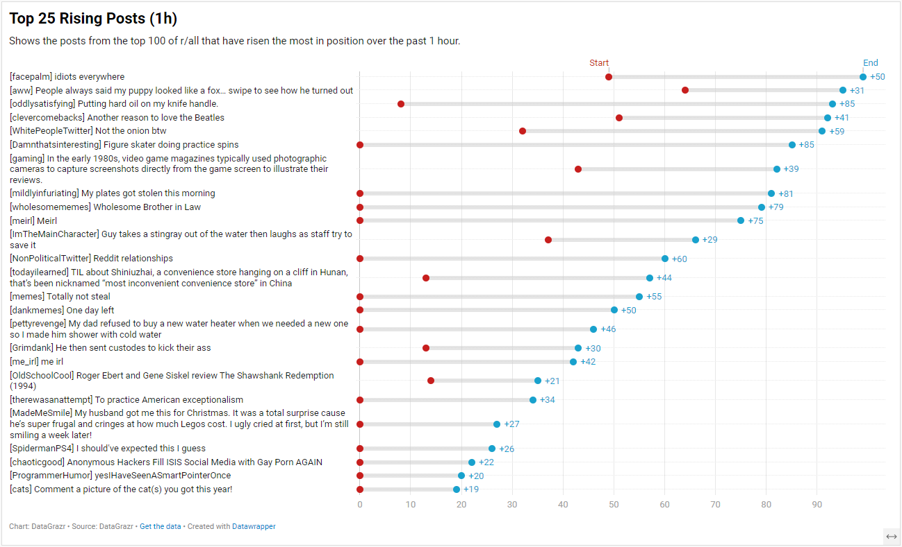
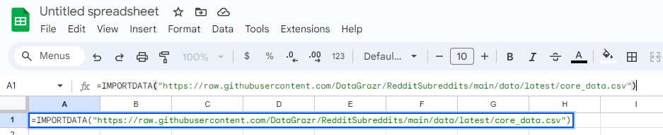
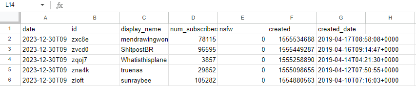
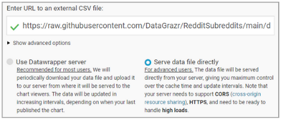

   


# DataGrazr Dataset: Reddit - Posts

This `Reddit - Posts` dataset represents the top 100 posts from Reddit's "r/all" page, as collected every hour. This dataset inserts 100 rows of data per hour.

> **A DataGrazr Dataset**  
> This dataset is part of the DataGrazr family of datasets. DataGrazr is an effort to provide data in a highly usable, portable, and accessible format for any use-case. DataGrazr provides many free (forever) datasets, as well as premium (paid) datasets, and consulting services for custom dataset creation.
> 
> Other datasets in this family include:
> * [Reddit - Subreddits](https://github.com/DataGrazr/RedditSubreddits) 
> * [Reddit - Posts](https://github.com/DataGrazr/RedditPosts) -- 🚀 You Are Here
> 
> For more information visit our website.

**Useful Reference URLs (from these docs):**
* [Python peewee documentation](https://docs.peewee-orm.com/en/latest/)
* [sqlite3 command line interface documentation](https://sqlite.org/cli.html)
* [Google Sheets IMPORTDATA documentation](https://support.google.com/docs/answer/3093335?hl=en)
* [Datawrapper 3rd party visualization tool](https://www.datawrapper.de/charts)

## 🛠️ Schema

Each row in this dataset represents a single Subreddit at a single point in time using daily granularity. 

| Field                 | Description |
| -----                 | -----------|
| `date`                | The UTC datetime that the row was collected, formatted as `YYYY-MM-DDTHH`. |
| `id`                  | The id of the reddit post. |
| `position`            | The position from 1 to 100 that the post appeared at the time of collection. Number 1 is at the top and 100 is at the bottom. |
| `score`               | The score of the post at the time of collection. |
| `subreddit_display_name` | Human readable display name of the subreddit that the post came from. |
| `subreddit_id`        | The subreddit ID that the post came from. This is more resilient to name or API changes. |
| `title`               | The title of the reddit post. |
| `is_self`             | A boolean value representing whether the post is a self post (text only). Value `0` is false, `1` is true. |
| `url`                 | The web URL to the reddit post. |
| `upvote_ratio`        | A float from 0-1 representing the ratio of upvotes to downvotes at the time of collection. |
| `num_comments`        | The number of comments submitted to the reddit post at the time of collection. |
| `created`             | The Unix timestamp of the post creation. |
| `created_date`        | The created field formatted as a `YYYY-MM-DDTHH:mm:ssZ` string. |


## 📖 Contents

The contents of this dataset are published in sqlite3, JSON, and CSV formats for various purposes.

| Item | Description  |
| ----- | -----------|
| `data.db` | There is a single sqlite3 binary at `./data/data.db` with a single `core_data` table. This table contains all of the core data for the data set in its raw form, as defined by the schema above. |
| `core_data.csv (.json)` | The entirety of the core data table is exported to `./data/core_data.csv` and `./data/core_data.json` whenever the dataset is updated. This is useful if you'd like to skip mounting a sqlite3 binary to leverage this data. |
| `YYYY/MM/DD/HH/core_data.csv (.json)` | In addition to the master data sets, there is a time filtered copy of core_data at each year, month, day, and hour. This serves as a much smaller dataset that can be used in cases where the entire set is not required. |
| `changes.csv (.json)` | The changes data export tracks the changes in position over multiple one hour time intervals, beginning at 1 hour and ending at 12 hours. You'll find columns `position_change_Nh` in this export, which compares the post's position N hours ago with the post's current position. Since position is measured from 1 (top) to 100 (bottom), a negative change means that the post went _up_ the front page, which may be counterintuitive. Adding (+) position and change_Nh will give you the posts raw position N hours ago. A `NULL` value in a change_Nh column indicates that the post was not present in the top 100 during that time period. The position column in this export represents the position at the row's collection date. |
| `stats.csv (.json)` | The stats data export tracks simple statistics over each date period regarding the entire dataset. Average score, average upvote ratio, and average comments are the three currently supported statistics for each day. |
| `project_stats.csv (.json)` | This is another metadata export that shows high level project statistics, including the total number of rows contained in the dataset, the earliest date, and the latest date. |

Here are some example paths that cover most of the exported data.

**Standard DataGrazr Artifacts:**
* `./data/data.db`
* `./data/core_data.csv (.json)`
* `./data/latest/core_data.csv (.json)`
* `./data/2023/core_data.csv (.json)`
* `./data/2023/12/core_data.csv (.json)`
* `./data/2023/12/29/core_data.csv (.json)`

**Reddit - Posts Specific Artifacts:**
* `./data/changes.csv (.json)`
* `./data/stats.csv (.json)`

## 🥼 Example Uses

This dataset contains many different ways to use the data in this repository, here are a few visual examples of how this dataset can be leveraged.

### Top 25 Biggest Movers Over 1 Hour



## 🧑‍🏫 How to Use

There are three recommended ways to consume this dataset:
1. Cloning this repository and using the sqlite3 CLI directly
2. Cloning this repository and programmatically mounting the data.db sqlite3 database
3. Using GitHub's raw endpoints to ingest the data into tools and/or code

### Linux sqlite3 Command Line

The simplest way to consume the `data.db` artifact is via the [sqlite3 command line interface](https://sqlite.org/cli.html) that can be installed in Linux via `apt-get install sqlite3` or `yum install sqlite3`. This provides a flexible and direct interface to the dataset, but requires the Linux CLI to execute. This method is a great intermediate step that can be used to export the data to whatever format you'd like, or run whatever custom query you want.

#### Example Command: Export All Data as CSV

```
$ sqlite3 -header -csv ./data/data.db 'select * from core_data ORDER BY date DESC;'
```

```
date,id,position,score,subreddit_display_name,subreddit_id,title,is_self,url,upvote_ratio,num_comments,created,created_date
2024-01-01T00,18vie0i,62,1660,CrappyDesign,2sa3m,"The armrest of my United Airlines seat has flight attendant call buttons. We are only 30 minutes into the flight, and they have already made two announcements not to accidentally push the buttons.",0,https://i.redd.it/8d6wma0yep9c1.jpeg,0.98,53,1704060573,2023-12-31T10:09:33+0000
2024-01-01T00,18viah4,81,1403,futurama,2qhqw,"Here's to another lousy millenium",0,https://i.redd.it/db5jaxx1ep9c1.jpeg,0.97,47,1704060262,2023-12-31T10:04:22+0000
2024-01-01T00,18vi8zh,29,2686,europe,2qh4j,"Estonia has fully legalized same-sex marriages!",0,https://i.redd.it/qfx1805ndp9c1.jpeg,0.85,494,1704060128,2023-12-31T10:02:08+0000
2024-01-01T00,18vhvhe,64,1761,maybemaybemaybe,38e1l,"Maybe Maybe Maybe ",0,https://v.redd.it/oyrb4tp7ap9c1,0.94,158,1704058987,2023-12-31T09:43:07+0000
...
```

#### Example Command: Export All Data as JSON

```
$ sqlite3 -json ./data/data.db 'select * from core_data ORDER BY date DESC;'
```

```
[
    {
        "date":"2024-01-01T00", 
        "id":"18vie0i", 
        "position":62, 
        "score":1660, 
        "subreddit_display_name": "CrappyDesign",
        "subreddit_id": "2sa3m",
        "title":"The armrest of my United Airlines seat has flight attendant call buttons. We are only 30 minutes into the flight, and they have already made two announcements not to accidentally push the buttons.",
        "is_self":0,
        "url":"https://i.redd.it/8d6wma0yep9c1.jpeg",
        "upvote_ratio":0.97999999999999998223,
        "num_comments":53,
        "created":1704060573,
        "created_date":"2023-12-31T10:09:33+0000"
    }, 
    ...
]
```

#### Example Command: Export All Data for a Single Post as CSV

```
$ sqlite3 -header -csv ./data/data.db 'select * from core_data WHERE id = "18vie0i" ORDER BY date DESC;'
```

```
date,id,position,score,subreddit_display_name,subreddit_id,title,is_self,url,upvote_ratio,num_comments,created,created_date
2024-01-01T00,18vie0i,62,1660,CrappyDesign,2sa3m,"The armrest of my United Airlines seat has flight attendant call buttons. We are only 30 minutes into the flight, and they have already made two announcements not to accidentally push the buttons.",0,https://i.redd.it/8d6wma0yep9c1.jpeg,0.98,53,1704060573,2023-12-31T10:09:33+0000
...
```

### Using GitHub's Raw URLs

Another way to consume this dataset is via raw URLs. GitHub provides a raw URL to all artifacts in a repository which looks like ``. Data from these URLs can be retrieved programmatically as though it were a standard JSON endpoint which cuts the need for server infrastructure in simple cases. This can also be used as an ingestion method, or direct access method using some of the methods explained below.


#### Example Command: Retrieve Raw Data via Requests

An example script can be found in `examples/raw_data_requests.py` and demonstrates how easy it is to pull data into a Python (or other) script using simple requests. This script can be run via `python ./examples/raw_data_requests.py`

```Python
import urllib.request
import json
from pprint import pprint

url = "https://raw.githubusercontent.com/DataGrazr/RedditPosts/main/data/latest/core_data.json"

print(f"Retrieving data from {url}")
with urllib.request.urlopen(url) as url_data:
    data = json.load(url_data)
    print(f"Got {len(data)} records back, printing the first 10...")
    pprint(data[0:10])
```

#### Using Raw Data as Sources in 3rd Party Tooling

Many 3rd party tools allow linking to web hosted CSV or JSON files, which is a perfect usecase for these raw URLs. Here are a few examples of tools that support this type of importing.

##### Google Sheets

Google Sheets has an `IMPORTDATA(url)` function that can be used to pull a CSV file from a raw URL into a live Google Sheet. Google's documentation on this function is [here](https://support.google.com/docs/answer/3093335?hl=en).



This will import the CSV as a table, which can be used for charting, formatting, parsing, etc. This URL is _live_, which means that auto-refreshing dashboards and visualizations can be built in Sheets using this method.



##### Datawrapper

Datawrapper is a web based visualization tool that can be seen at https://www.datawrapper.de/charts. Within the chart builder an external URL can be used as a data source.



### Python peewee

Another, more advanced method to programmatically leverage this dataset is via Python's peewee module. Python peewee is an excellent ORM module that works out of the box with sqlite3 (which is what the `data.db` artifact is built with). 

Python peewee provides Python "wrappers" around the sqlite3 .db file and will handle connecting and generating SQL for you. This can dramatically simplify the complexity of a database centered application. Included below is the model that is used within this data set. Additionally an example script is provided at `examples/peewee.py` as a starting point for using peewee in concert with this dataset. 

_Make sure you pip install peewee before attempting to run this example script._

This example script can be run with `python examples/peewee.py` from the root of this dataset.

```Python
import os
from peewee import *

# We have to do this path detection because we don't know whether
# the example script will be run from within /examples or from the 
# root of the repository.
file_path = os.path.abspath(os.path.dirname(__file__))
db = SqliteDatabase(f'{file_path}/../data/data.db')
db.connect()

# This class can be pasted into any Python script which leverages peewee
class RedditPost(Model):
    date = DateTimeField()
    id = CharField()
    position = IntegerField()
    score = IntegerField()
    subreddit_display_name = CharField()
    subreddit_id = CharField()
    title = CharField()
    is_self = BooleanField()
    url = CharField()
    upvote_ratio = FloatField()
    num_comments = IntegerField()
    created = IntegerField()
    created_date = DateTimeField()
    
    class Meta:
        db_table = "core_data"
        database = db
        
        indexes = (
            (('date', 'id'), True),
        )

# Print out some details from the top 100 rows when ordered by date (descending)
for post in RedditPost.select().order_by(RedditPost.date.desc()).limit(100):
    print(f"[{post.date}] {post.title} ({post.score})")
```


### Parsing sqlite3 Dates With This Dataset

sqlite3 doesn't actually store data as a datetime object, instead it supports a few different integer or string formats, which are [documented here](https://www.sqlite.org/lang_datefunc.html). The dates in all DataGrazr projects are stored in a UTC-only string sortable format, but doing anything beyond sorting requires additional logic.

The `arrow` module is a great datetime library available for Python, but not everyone wants to rely on an additional module for their project. Here's an example script that contains both native datetime parsing of these date fields as well as arrow parsing. This example can be run with `python ./examples/using_dates.py` from the root of this dataset.

```Python
import urllib.request
import json
import arrow
from datetime import datetime
from pprint import pprint

url = "https://raw.githubusercontent.com/DataGrazr/RedditPosts/main/data/latest/core_data.json"

print(f"Retrieving data from {url}")
with urllib.request.urlopen(url) as url_data:
    data = json.load(url_data)
    row = data[0]
    
    datetime_string = row['date']
    datetime_object = datetime.strptime(datetime_string, '%Y-%m-%dT%H')
    
    arrow_object = arrow.get(datetime_string, 'YYYY-MM-DDTHH')
    
    print(f"Python datetime object: {datetime_object}")
    print(f"Python arrow object: {arrow_object}")
```
